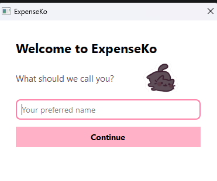
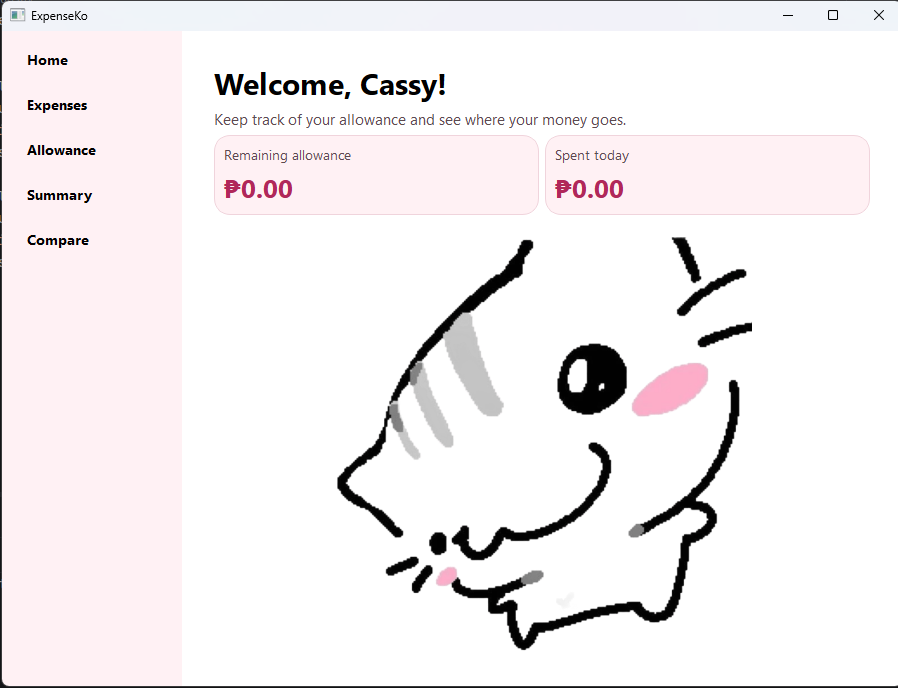
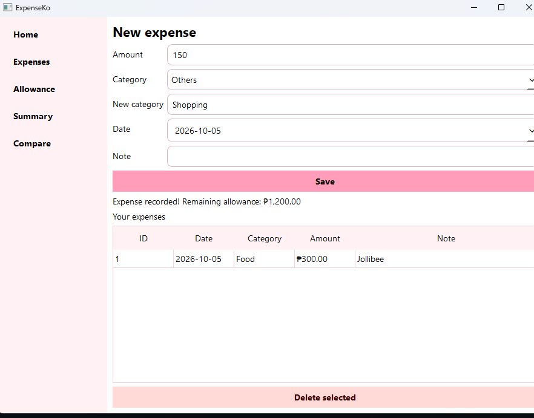
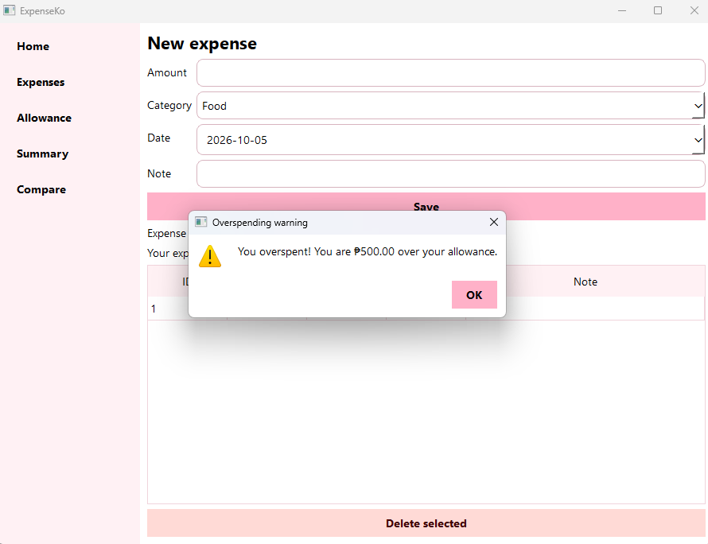
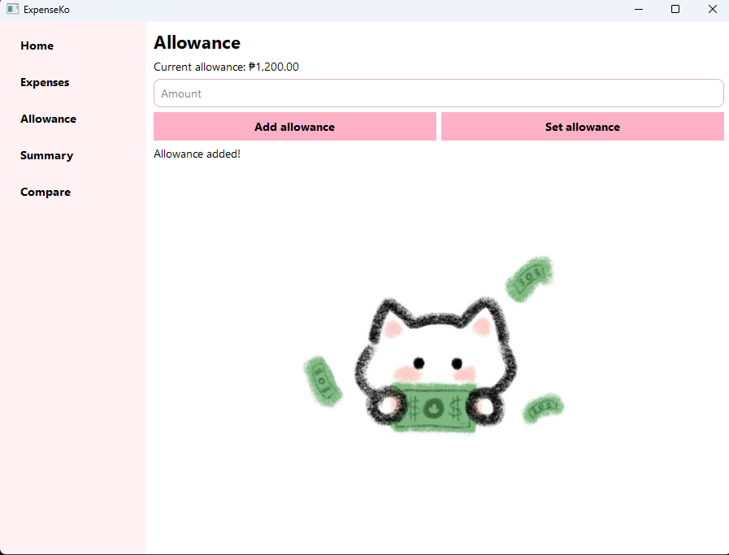
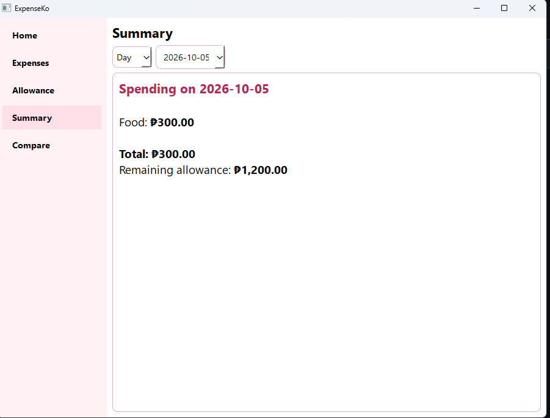
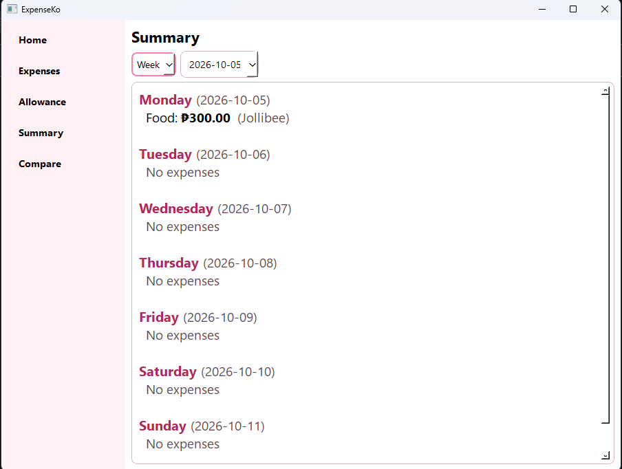
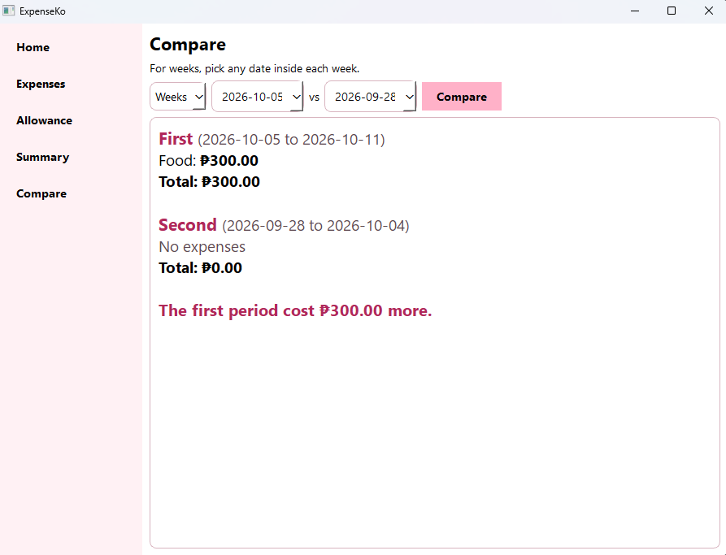

# ExpenseKo
**ExpenseKo** is a Python-Based Daily Allowance and Expense Tracker for Students.

---

## Project Description

ExpenseKo helps a student keep track of their allowance and daily spending. The user enters their allowance, records each expense with a category, date and note, and the system updates the remaining allowance automatically. It warns the user when they overspend, shows daily and weekly summaries, and can compare the spending of two days or two weeks.

**Problem it addresses:** Students who receive a regular allowance often run out of money without knowing where it went. Writing expenses down by hand is easy to forget, and adding everything up is tedious. ExpenseKo records spending in one place, calculates what is left, and shows where the money went.

## Project Objectives

- Apply object-oriented programming in a complete Python application.
- Separate the program into packages by feature, keeping the data logic apart from the user interface.
- Build a graphical user interface with PyQt6, styled with QSS.
- Store data permanently in an SQLite database so records are kept between sessions.
- Validate user input so wrong values do not crash the program.
- Let the user monitor and compare their spending over time.

## Features

- **Welcome screen:** On the first launch, the app asks for the user's preferred name. The Home page then greets the user by name.
- **Home dashboard:** Shows the remaining allowance and the amount spent today.
- **Add expense:** Records the amount, category, date and an optional note, then deducts the amount from the allowance.
- **Overspending warning:** A pop-up warns the user ("You overspent!") when an expense makes the remaining allowance go below zero, and shows how much they are over by.
- **Custom categories:** Choosing "Others" lets the user type a new category, which then appears in the category list.
- **Delete expense:** Removes a selected expense from the table and returns its amount to the allowance.
- **Allowance management:** Adds to the current allowance or sets it to a new amount.
- **Summary:** Shows spending for one day (totals per category) or a full week (Monday to Sunday, with each day's expenses).
- **Compare periods:** Compares the total spending of two weeks or two days and shows which one cost more.
- **Data persistence:** Everything is saved to an SQLite database and loaded again on the next launch.
- **Input validation:** Invalid input (letters in an amount field, zero or negative amounts) shows a message instead of crashing the program.

## Technologies Used

| Item | Technology |
|---|---|
| Programming language | Python 3.9 or newer |
| GUI framework | PyQt6, styled with QSS (Qt Style Sheets) |
| Database | SQLite, accessed through Python's built-in `sqlite3` module |
| Other libraries | `dataclasses`, `datetime`, `pathlib`, `sys` (all from the Python standard library) |
| Tools | PyCharm, Git and GitHub |

## Project Structure

```
ExpenseKo/
├── main.py
├── expenseko.db                  (created automatically on first run)
├── images/
│   ├── mingming.png
│   ├── kitty.png
│   └── cat.jpg
├── screenshots/
├   └── allowance_page.png
├   └── compare_page.png
├   └── expenses_page.png
├   └── home_page.png
├   └── overspending_warning.png
├   └── summary_page1.png
├   └── summary_page2.png
├   └── welcome_screen.png
├── allowance_management/
│   ├── __init__.py
│   ├── allowance_manager.py
│   └── models.py
├── expense_tracking/
│   ├── __init__.py
│   ├── expense_tracker.py
│   └── models.py
├── database/
│   ├── __init__.py
│   └── database.py
└── dashboard/
│       ├── __init__.py
│       ├── view_summary.py
│       └── compare_periods.py
└── ui/dashboard/
│   ├── __init__.py
│   ├── login_dialog.py
│   ├── home_page.py
│   ├── expense_page.py
│   ├── allowance_page.py
│   ├── summary_page.py
│   ├── compare_page.py
│   ├── styled_text.py
    
```

| File or folder | Purpose |
|---|---|
| `main.py` | Entry point. Loads the saved data, asks for the user's name on first launch, builds the main window and its styles, and starts the app. |
| `images/` | Pictures used in the interface. |
| `screenshots/` | Screenshots used in this README. |
| `allowance_management/` | Allowance feature. `models.py` defines the `User` class, and `allowance_manager.py` defines `AllowanceManager`, which adds or sets the allowance. |
| `expense_tracking/` | Expense feature. `models.py` defines the `Expense` class and the default categories, and `expense_tracker.py` defines `ExpenseTracker`, which adds and deletes expenses and calculates totals. |
| `database/` | `database.py` defines `Storage`, which creates the SQLite tables and saves and loads the data. |
| `ui/dashboard` | Everything the user sees: the login dialog and one page for each sidebar button. |
| `dashboard/` | The logic behind the report pages: `view_summary.py` prepares daily and weekly summaries, and `compare_periods.py` compares two periods and finds the week range for a date. |
| `ui/styled_text.py` | A small helper that adds bold, colored text to the Summary and Compare text boxes. |

## Installation and Setup

**Requirements:** Python 3.9 or newer and the `PyQt6` package. SQLite comes with Python, so nothing else needs to be installed.

1. Clone the repository:
```
   git clone https://github.com/cuhsay/ExpenseKo.git
   cd ExpenseKo
```
2. Create a virtual environment:
```
   python -m venv .venv
```
3. Activate it:
   - Windows: `.venv\Scripts\activate`
   - macOS / Linux: `source .venv/bin/activate`
4. Install the dependency:
```
   pip install PyQt6
```
5. Run the program **from the project folder** (the one that contains `main.py`):
```
   python main.py
```

The database file `expenseko.db` is created automatically the first time the program runs.

## How to Use the System

1. Run `main.py`. On the first launch, type your preferred name in the welcome screen and click **Continue**.
2. Open **Allowance** and enter an amount. Click **Add allowance** to add to your current allowance, or **Set allowance** to replace it.
3. Open **Expenses**. Enter the amount, choose a category, pick a date and add an optional note, then click **Save**. If you choose "Others", a box appears where you can type a new category name. If the expense is more than your remaining allowance, a warning pop-up tells you how much you overspent.
4. To delete an expense, click its row in the "Your expenses" table and click **Delete selected**.
5. Open **Home** to see your welcome message, the remaining allowance, and how much you spent today.
6. Open **Summary**, choose **Day** or **Week**, and pick a date to see the spending for that day or week.
7. Open **Compare**, choose **Weeks** or **Days**, pick two dates (for weeks, any date inside each week), and click **Compare**.
8. Close the program whenever you like. Your data is saved automatically and will be there next time.

## OOP Implementation

### Important classes and objects

| Class | File | Role |
|---|---|---|
| `User` | `allowance_management/models.py` | Holds the user's name, allowance, expenses and the counter for the next expense ID. |
| `Expense` | `expense_tracking/models.py` | Holds one expense: ID, category, amount, date and note. |
| `AllowanceManager` | `allowance_management/allowance_manager.py` | Adds to or sets the allowance, rejecting invalid amounts. |
| `ExpenseTracker` | `expense_tracking/expense_tracker.py` | Adds and deletes expenses, updates the allowance, and calculates category totals and category lists. |
| `Storage` | `database/database.py` | Creates the tables and saves and loads the user and expenses. |
| `ViewSummary` | `dashboard/view_summary.py` | Prepares the daily and weekly summary data. |
| `ComparePeriods` | `dashboard/compare_periods.py` | Prepares the comparison of two days or two weeks. |
| `MainWindow`, `LoginDialog`, `HomePage`, `ExpensePage`, `AllowancePage`, `SummaryPage`, `ComparePage` | `main.py` and `ui/` | The windows and pages of the interface. |
| `StyledText` | `ui/styled_text.py` | Writes styled text into a text box. |

**Objects:** `main.py` creates one `Storage`, loads one `User`, and gives that same `User` to one `ExpenseTracker` and one `AllowanceManager`. Because they share the same object, a change made on one page (for example, adding an expense) is immediately reflected on the others (for example, the allowance page). The pages receive these objects through their constructors.

### Encapsulation

- The data and the operations on it are grouped into classes. The `User` object holds the data, while `AllowanceManager` and `ExpenseTracker` change it through methods such as `add_allowance`, `add_expense` and `delete_expense`. These methods check the input first and raise a `ValueError` for invalid values, so the data is never changed by invalid input.
- All SQL is hidden inside `Storage`. The pages only call `save` and `load` and never write SQL themselves.
- The report classes (`ViewSummary`, `ComparePeriods`) only return data, and the pages decide how to display it. Calculation and display are kept separate.
- Python does not enforce private attributes, so this encapsulation works by design and convention. The pages do read values such as `user.allowance` directly for display, but they change data only through the manager methods.

### Inheritance

The interface classes inherit from PyQt6 classes: `MainWindow` extends `QMainWindow`, `LoginDialog` extends `QDialog`, and each page (`HomePage`, `ExpensePage`, `AllowancePage`, `SummaryPage`, `ComparePage`) extends `QWidget`. They reuse the framework's window and layout behavior and add their own features on top. The project's data and logic classes do not use inheritance, because they have no shared behavior that needs a parent class.

### Polymorphism

Each page overrides the `showEvent` method inherited from `QWidget` to refresh its own content when it is shown. The `QStackedWidget` in `MainWindow` treats every page as a plain `QWidget` and calls the same method on whichever page is displayed, and each page responds in its own way (the Home page updates the cards, the Compare page re-runs the comparison, and so on). This polymorphism comes from using PyQt6; the project does not define its own class hierarchy for it.

## Database

ExpenseKo uses a single SQLite file, `expenseko.db`, which is created automatically. The database holds data for **one user**.

### Tables

**`user`**

| Column | Type | Description |
|---|---|---|
| `id` | INTEGER, primary key | Always `1`, because there is only one user. |
| `name` | TEXT | The user's preferred name. |
| `allowance` | REAL | The remaining allowance. |
| `next_expense_id` | INTEGER | The ID that the next new expense will receive. |

**`expenses`**

| Column | Type | Description |
|---|---|---|
| `id` | INTEGER, primary key | Unique ID of the expense. |
| `category` | TEXT | Category name. |
| `amount` | REAL | Amount spent. |
| `date` | TEXT | Date in `YYYY-MM-DD` format. |
| `note` | TEXT | Optional note (empty by default). |

### Database operations

| Operation | How the system does it |
|---|---|
| **Create** | `Storage.save()` inserts the user row and one row for each expense. New expenses are created in memory by `ExpenseTracker.add_expense()` and written to the database when the program saves. |
| **Read** | `Storage.load()` reads the user row and all expense rows when the program starts, and rebuilds the `User` and `Expense` objects. |
| **Update** | Adding or setting the allowance changes the user's allowance in memory, and the new value is written to the `user` table on the next save. |
| **Delete** | `ExpenseTracker.delete_expense()` removes the expense from memory, and the following save no longer includes its row. |
| **Search / filter** | There is no keyword search. Expenses are filtered by date range or month inside `ExpenseTracker` (`get_category_totals`, `get_expense_summary`), which powers the Home, Summary and Compare pages. |

Note: `Storage.save()` clears both tables and writes the current data back in a single transaction, so a failed save cannot leave half-written data.

## Screenshots

**Welcome screen**



The first-launch screen that asks for the user's preferred name.

**Home page**



The welcome message, the remaining allowance and spent-today cards.

**Expenses page**



The new expense form, the custom category box, and the table of saved expenses with the delete button.

**Overspending warning**



The pop-up that appears when an expense makes the remaining allowance go below zero.

**Allowance page**



Shows the current allowance and lets the user add to it or set it.

**Summary page**




The daily or weekly summary of spending.

**Compare page**



The comparison of two weeks or two days, with the difference between them.

## Testing

The system was tested manually by running the application and checking the results. The backend logic (the manager classes, summaries and comparison) was also checked with a short script that used sample data, outside of the interface.

| # | Test | Steps | Expected result | Actual result |
|---|---|---|---|---|
| 1 | First launch | Delete `expenseko.db` and run the program | The welcome screen appears; after entering a name, Home shows "Welcome, name!" | Matched expected |
| 2 | Empty name | Click Continue with an empty name box | "Please enter a name." appears and the window stays open | Matched expected |
| 3 | Add allowance | Enter `500` and click Add allowance | Current allowance shows ₱500.00 | Matched expected |
| 4 | Invalid allowance | Enter `abc`, then `0` | "Amount must be a number." and "Amount must be greater than zero." appear, with no crash | Matched expected |
| 5 | Add expense | Add ₱80, Food, today, "lunch" | The message shows a remaining allowance of ₱420.00 and the expense appears in the table | Matched expected |
| 6 | Overspending warning | With ₱100 allowance, add an expense of ₱150 | A warning pop-up says "You overspent! You are ₱50.00 over your allowance." and the expense is still saved | Matched expected |
| 7 | Custom category | Choose "Others", type `School`, add an expense | The expense is saved as "School" and "School" appears in the category list | Matched expected |
| 8 | Delete expense | Select a row and click Delete selected | The row disappears and its amount is returned to the allowance | Matched expected |
| 9 | Delete with no selection | Click Delete selected with nothing selected | "Select an expense to delete first." appears | Matched expected |
| 10 | Day summary | Open Summary, choose Day for a date with expenses | Category totals, the day's total and the remaining allowance are shown | Matched expected |
| 11 | Week summary | Choose Week | Seven days (Monday to Sunday) are listed with their expenses, and empty days show "No expenses" | Matched expected |
| 12 | Compare weeks | Spend ₱100 this week and ₱50 last week, then compare Weeks | "The first period cost ₱50.00 more." | Matched expected |
| 13 | Compare days | Compare two days with different totals | Totals for both days and the difference are shown | Matched expected |
| 14 | Persistence | Close and reopen the program | Name, allowance and expenses are all still there, and the name screen does not appear again | Matched expected |

## Known Issues / Limitations

- **Single user only.** The database stores one user. Multiple profiles are not supported.
- **No editing of expenses.** An expense can be added or deleted, but not edited. To fix a mistake, delete it and add it again.
- **Overspending is warned about, not blocked.** The app shows an "You overspent!" pop-up, but the expense is still saved and the allowance stays below zero. The warning appears again after each further expense while the allowance is negative.
- **Custom categories depend on saved expenses.** A custom category stays in the list only while at least one saved expense uses it. Deleting the last expense in that category removes it from the list.
- **Dates are not restricted.** Future dates can be selected when adding an expense.
- **The Summary page has Day and Week views only.** The backend can summarize a whole month, but there is no month view in the interface yet.
- **Money is stored as decimal numbers (`float`),** which can cause tiny rounding differences in very long calculations.
- **Run from the project folder.** The database and the login image use relative paths, so start the program with `python main.py` from the folder that contains `main.py`.
- **Database changes.** If the table design is changed in the code, the old `expenseko.db` must be deleted so the new tables can be created.
- **Manual testing only.** The project has no automated unit tests.

## Author

- **Name:** Cassandra Gayle Rabanillo
- **Section:** CS26L(3581) BSCS - 2ND YEAR
